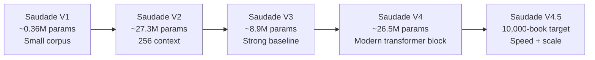
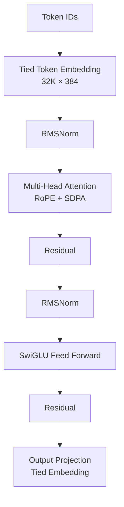
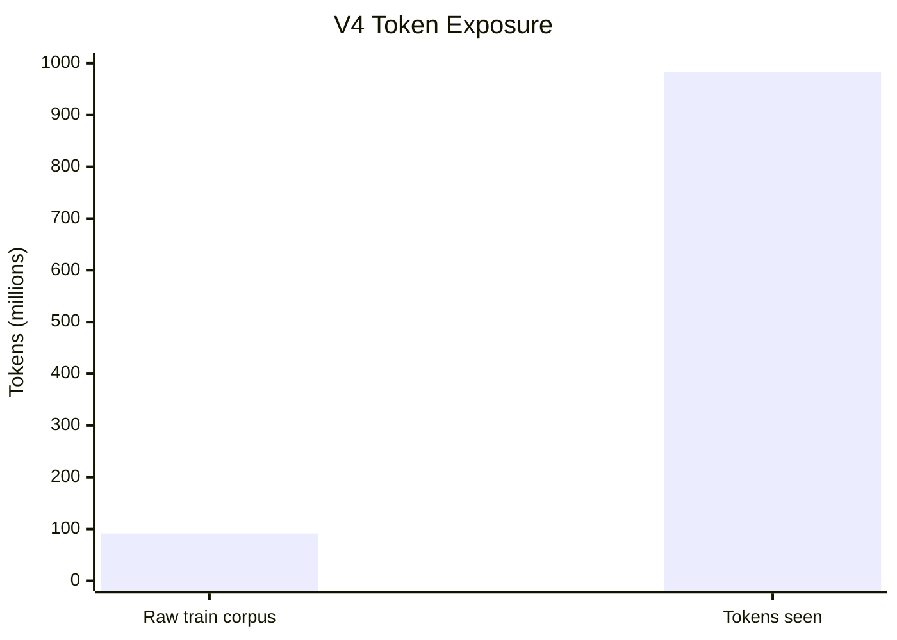
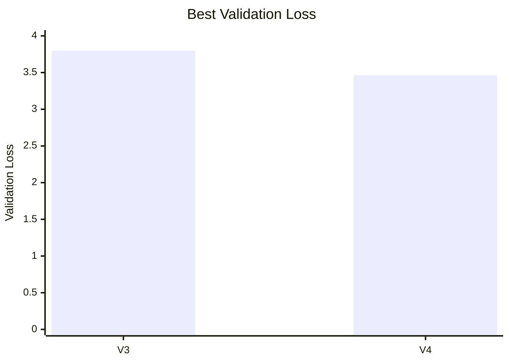
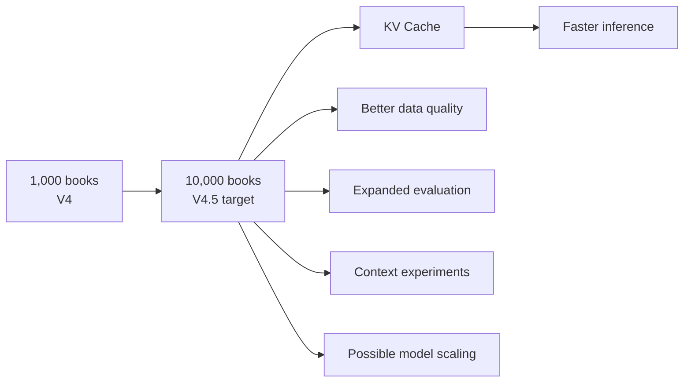
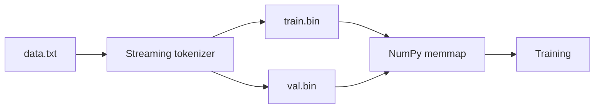
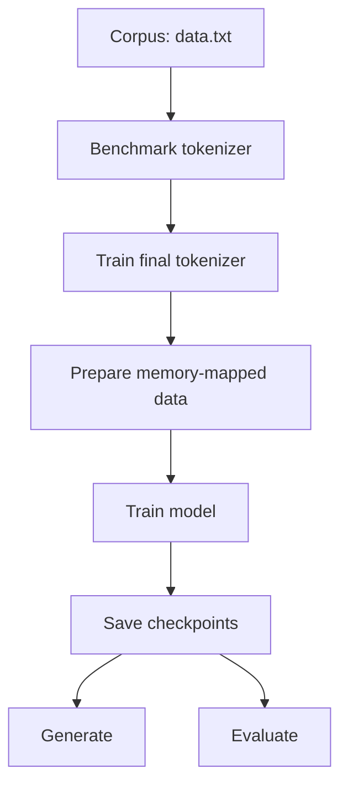
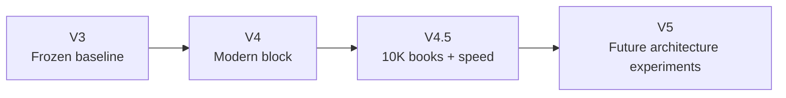

# Saudade V4

<div align="center">

# 🕯️ Saudade V4

### A small from-scratch language model with a modern transformer block

**RoPE · RMSNorm · SwiGLU · SDPA · 32K vocabulary · 512-token context**

[](https://github.com/jadhavdurvesh/microgpt_by_DMJ/releases)
[](https://www.python.org/)
[](https://pytorch.org/)
[](https://github.com/jadhavdurvesh/microgpt_by_DMJ)

</div>

---

## 🌌 What is Saudade V4?

**Saudade V4** is the fourth major generation of the Saudade from-scratch language-model project.

V4 is the **modern-block experiment** in the Saudade roadmap: instead of immediately trying to make the model enormous, it asks a more useful research question:

> **Can a deliberately small model benefit substantially from a more modern transformer architecture and a better training pipeline?**

V4 introduces:

- **RoPE** positional embeddings
- **RMSNorm**
- **SwiGLU**
- PyTorch **scaled dot-product attention (SDPA)**
- A **32K SentencePiece tokenizer**
- **512-token context**
- Tied input/output embeddings
- AdamW with warmup + cosine scheduling
- Periodic and best-validation checkpointing
- Resumable training
- Token-count tracking
- Rich checkpoint metadata
- Memory-mapped dataset preparation
- Configurable generation and evaluation
- Experiment snapshots

The model is intentionally still small enough to train and study on relatively accessible GPU infrastructure.

---

# 🧭 The Saudade Journey



V3 is treated as the **frozen baseline**.

V4 is not intended to erase or modify V3. It is a separate experiment.

---

# 📊 V4 at a Glance

| Metric | Saudade V4 |
|---|---:|
| 📚 Books | **1,000** |
| 🧩 Training tokens | **91,434,783** |
| 🧪 Validation tokens | **1,866,016** |
| 🔤 Vocabulary | **32,000** |
| 🧠 Embedding size | **384** |
| 🏗️ Transformer layers | **8** |
| 👁️ Attention heads | **8** |
| 🪟 Context length | **512** |
| 🔄 Position encoding | **RoPE** |
| 📐 Normalization | **RMSNorm** |
| ⚡ FFN | **SwiGLU** |
| 🚀 Attention | **PyTorch SDPA** |
| 🔗 Weight tying | **Yes** |
| 👀 Tokens seen | **983,040,000** |
| 🏆 Best validation loss | **3.4639** |
| 🔢 Final recorded step | **59,999** |
| 📦 Model scale | **~26.5M parameters** |

> **Dataset correction:** V4 uses **1,000 books**. The **10,000-book** corpus belongs to the planned V4.5 expansion.

---

# 🧠 Architecture

V4 replaces several of the simpler architectural choices used by V3.



### Core configuration

```text
vocab_size = 32,000
block_size = 512
embed_size = 384
heads      = 8
layers     = 8
```

The approximate model size is **26.5M parameters**.

---

# 🔬 Why These Changes?

## RoPE

V4 uses **Rotary Positional Embeddings** instead of learned positional embeddings.

RoPE integrates positional information into the attention computation and is widely used in modern transformer architectures.

---

## RMSNorm

V4 replaces LayerNorm with RMSNorm.

The objective is a simpler normalization mechanism with lower computational overhead while maintaining stable training.

---

## SwiGLU

V4 replaces the GELU feed-forward block with **SwiGLU**.

The V4 design uses an approximately **2.67× feed-forward expansion**, following the general sizing philosophy used by modern LLM architectures.

---

## SDPA

Instead of manually implementing:

```text
Q × Kᵀ
↓
softmax
↓
× V
```

V4 uses:

```python
torch.nn.functional.scaled_dot_product_attention
```

This allows PyTorch to select an optimized attention implementation when supported by the hardware/software stack.

---

# 📈 V3 → V4

| Feature | V3 | V4 |
|---|---|---|
| 📚 Corpus | 1,033 books | **1,000 books** |
| 🔤 Vocabulary | 16K | **32K** |
| 🪟 Context | 256 | **512** |
| 🧠 Embedding | 256 | **384** |
| 🏗️ Layers | 6 | **8** |
| 👁️ Heads | 8 | **8** |
| 📍 Position | Learned embeddings | **RoPE** |
| 📐 Normalization | LayerNorm | **RMSNorm** |
| ⚡ FFN | GELU, 4× | **SwiGLU, ~2.67×** |
| 🚀 Attention | Hand-written | **SDPA** |
| 🔗 Weight tying | Yes | **Yes** |
| 💾 Dataset loading | RAM-heavy pipeline | **Memory-mapped** |
| 📊 Progress | Steps | **Steps + tokens seen** |
| 💾 Checkpoints | Periodic + best | **Periodic + best** |
| 🔄 Resume | Yes | **Yes** |
| 🧪 Evaluation | Basic | **Expanded evaluation** |
| 🔬 Experiment tracking | Limited | **Experiment snapshots** |
| 🏆 Best val loss | **3.7963** | **3.4639** |

### Validation-loss improvement

```text
V3 best validation loss:  3.7963
V4 best validation loss:  3.4639
```

Absolute improvement:

```text
3.7963 - 3.4639 = 0.3324
```

Relative reduction:

```text
≈ 8.75%
```

So V4's recorded best validation loss is lower than V3's baseline.

> This does **not** by itself prove that every architectural change caused the improvement. Dataset, tokenizer, training schedule, model size, and other changes also differ. V4 is an experiment, not a controlled single-variable ablation.

---

# 📚 Dataset

## V4 Dataset

The V4 corpus contains:

```text
1,000 books
91,434,783 training tokens
1,866,016 validation tokens
```

The dataset is upstream of this repository's training pipeline.

The corpus preparation process is responsible for obtaining and quality-checking the source material.

---

## Why V4 Is Not a 10,000-Book Model

There are two separate dataset milestones:

```text
Saudade V4
1,000 books
        │
        │ 10× expansion
        ▼
Saudade V4.5
10,000 books target
```

The **10,000-book corpus is V4.5**, not V4.

---

# 🔁 Why Did V4 See 983M Tokens?

A common point of confusion is:

```text
Dataset:
91.43M training tokens

Tokens seen:
983.04M
```

The model did not magically acquire 983M unique tokens.

Training repeatedly passed through the dataset.

Approximate dataset-equivalent exposure:

```text
983,040,000 / 91,434,783
≈ 10.74
```

So V4 processed roughly **10.7 dataset-equivalent passes** worth of training tokens.

This is normal for language-model training.

---

# 🧮 Training Exposure



The distinction is:

- **Raw corpus tokens** = unique token stream available for training
- **Tokens seen** = number of token positions processed across the complete training run

---

# 🏆 Training Result

V4's final checkpoint reports:

```text
Train tokens:
91,434,783

Validation tokens:
1,866,016

Tokens seen:
983,040,000

Best validation loss:
3.4639

Step:
59999

Git commit:
016e602
```

The approximate perplexity corresponding to the best loss is:

```text
exp(3.4639) ≈ 31.99
```

---

# 📉 V3 vs V4 Validation Loss



Lower is better.

V4:

```text
3.4639
```

V3:

```text
3.7963
```

---

# 🧩 Tokenizer

V4 uses a **32,000-token SentencePiece tokenizer**.

The tokenizer is a critical part of the model.

A checkpoint trained with a 32K vocabulary cannot safely be decoded with an unrelated 2K tokenizer.

## Important deployment lesson

During V4 deployment, a tokenizer mismatch produced:

```text
IndexError: OUT_OF_RANGE: piece id is out of range
```

The model expected 32,000 token IDs, while the incorrectly loaded tokenizer contained only 2,000 pieces.

The correct V4 release therefore includes:

```text
tokenizer.model
tokenizer.vocab
```

alongside the checkpoint.

---

# 🎲 Generation

V4 retains the generation controls introduced in V3.

Supported:

- Temperature
- Top-k
- Top-p
- Repetition penalty
- Greedy decoding
- Configurable output length

Default settings:

```text
temperature         = 0.7
top_k               = 50
top_p               = 0.9
repetition_penalty  = 1.2
greedy              = False
max_new_tokens      = 500
```

---

# 🧪 Greedy vs Sampling

### Sampling

```text
greedy = False
temperature = 0.7
top_k = 50
top_p = 0.9
```

Sampling allows multiple plausible continuations and generally produces more varied output.

### Greedy

```text
greedy = True
```

Greedy decoding always selects the highest-probability token.

It is useful for deterministic experiments, but it can become more repetitive.

---

# ✍️ Example Generation

Prompt:

```text
The night was quiet and
```

A sampled V4 generation produced literary-style continuation such as:

```text
The night was quiet and the sun still beating in his face...
```

A greedy run produced a different deterministic continuation beginning:

```text
The night was quiet and the sun had set...
```

These examples are qualitative demonstrations, not benchmark scores.

---

# ⏱️ Long Generation

The default output length is:

```text
500 tokens
```

The script can be changed to generate:

```text
1,000
5,000
10,000+
```

tokens.

However, V4 has a **512-token context window**.

Therefore:

> Generating 10,000 tokens does not give V4 a 10,000-token context.

The model continues generation while only the active context window is available to attention.

Long generation is also relatively slow because the current implementation does not use a KV cache.

---

# ⚡ V4.5 Roadmap

V4.5 is the next major optimization/scaling experiment.



## Planned V4.5 improvements

### 📚 10,000-book corpus

The main dataset target is:

```text
1,000 books → 10,000 books
```

That is a **10× increase in book count**.

The final token count must be measured after the corpus is actually constructed.

---

### ⚡ KV Cache

V4.5 should implement a Key-Value cache for autoregressive generation.

Instead of recomputing attention information for previous tokens, previously calculated keys and values can be reused.

This should be one of the largest inference-speed improvements.

---

### 🌊 Streaming generation

V4.5 should support streaming output so generated tokens can appear progressively.

---

### 🚀 Attention optimization

Potential areas:

- PyTorch SDPA
- Flash Attention where supported
- Fused operations
- Reduced memory copies
- Better GPU utilization

---

### 🪟 Context experiments

Potential context sizes:

```text
512
1024
2048
4096
```

The final choice should be determined by memory and training benchmarks.

---

### 📊 Better evaluation

V4.5 should measure more than validation loss.

Planned metrics:

```text
Validation loss
Perplexity
Tokens/sec
Training time
Inference tokens/sec
Generation latency
Peak GPU memory
Repetition rate
Unique-token ratio
Long-context behavior
```

---

# 🚫 Deliberately Not in V4

V4 intentionally does **not** attempt to implement every modern LLM technique.

Not included:

- ❌ GQA
- ❌ MoE
- ❌ KV cache
- ❌ Instruction tuning
- ❌ RLHF
- ❌ Large-scale instruction datasets

These are reserved for later experiments where they make sense.

Instruction tuning is especially intended to be a separate stage performed after establishing a strong pretrained base model.

---

# 🏗️ Project Structure

```text
saudade_v4/
│
├── config.py
├── model.py
├── tokenizer_benchmark.py
├── train_tokenizer.py
├── prepare_data.py
├── train.py
├── generate.py
├── evaluate.py
├── utils.py
│
├── data.txt
│
├── train.bin
├── val.bin
│
├── tokenizer.model
├── tokenizer.vocab
│
├── checkpoints/
│   ├── checkpoint_*.pt
│   └── checkpoint_best.pt
│
└── experiments/
    └── <experiment-name>/
```

---

# 📄 File Guide

| File | Purpose |
|---|---|
| `config.py` | Architecture, training, generation and evaluation configuration |
| `model.py` | Saudade V4 transformer implementation |
| `tokenizer_benchmark.py` | Compare tokenizer vocabulary sizes |
| `train_tokenizer.py` | Train the final SentencePiece tokenizer |
| `prepare_data.py` | Stream/tokenize data into memory-mapped binaries |
| `train.py` | Main training loop |
| `generate.py` | Text generation |
| `evaluate.py` | Fixed evaluation prompt suite |
| `utils.py` | Git metadata, dataset fingerprinting and experiment helpers |

---

# 💾 Memory-Efficient Dataset Pipeline

One of the major engineering lessons from the previous versions was dataset memory usage.

Instead of loading and tokenizing the entire corpus into RAM, V4's intended pipeline is:



The dataset is stored as memory-mapped binary files rather than requiring the complete tokenized corpus to reside in RAM.

This is especially important as the dataset grows toward the V4.5 10,000-book target.

---

# 💾 Why Memory Mapping Matters

A large text corpus can consume substantial RAM after tokenization.

Memory mapping allows the training process to access portions of the dataset as needed.

Conceptually:

```text
Traditional approach:

data.txt
   ↓
tokenize everything
   ↓
huge RAM allocation
   ↓
OOM risk
```

V4 approach:

```text
data.txt
   ↓
stream/tokenize
   ↓
train.bin / val.bin
   ↓
memory mapping
   ↓
sample batches as required
```

This keeps dataset storage largely outside normal process RAM usage.

---

# 🔄 Training Workflow



---

# 🚀 Quick Start

Install dependencies:

```bash
pip install -r requirements.txt
```

Place the V4 corpus in:

```text
data.txt
```

### 1. Benchmark tokenizer sizes

```bash
python tokenizer_benchmark.py --vocab-sizes 16000 32000 50000
```

### 2. Train the tokenizer

Set the selected vocabulary size in `config.py`, then:

```bash
python train_tokenizer.py
```

### 3. Prepare the dataset

```bash
python prepare_data.py
```

This produces:

```text
train.bin
val.bin
```

### 4. Train

```bash
python train.py
```

### CLI overrides

Training parameters can be overridden without editing the configuration:

```bash
python train.py --batch-size 16 --steps 50000
```

### Resume training

```bash
python train.py --resume checkpoints/checkpoint_20000.pt
```

### Experiment snapshot

```bash
python train.py --experiment-name v4_baseline
```

### Generate

```bash
python generate.py
```

### Evaluate

```bash
python evaluate.py --checkpoint checkpoints/checkpoint_best.pt
```

---

# 🧪 Evaluation Philosophy

V4 is intended to be evaluated quantitatively and qualitatively.

A single generated paragraph is useful for demonstration, but it is not enough to establish that one model is better.

The evaluation pipeline therefore considers:

```text
Validation loss
Perplexity
Generation behavior
Repetition
Unique-token ratio
Category-specific prompts
Long-context behavior
```

The goal is to make future comparisons between V4, V4.5 and later versions more meaningful.

---

# 📋 Suggested Evaluation Categories

The V4 evaluation design includes categories such as:

```text
STORY
DIALOGUE
DESCRIPTION
CONTINUATION
LONG_CONTEXT
RARE_WORDS
REPETITION
```

These probe different aspects of the model rather than relying on a single prompt.

---

# 🔍 What V4 Is Actually Testing

V4 is not simply:

> "Can we make a bigger model?"

The main experiment is closer to:

> **Does a modern transformer block produce a measurable improvement at this scale?**

The answer must be interpreted carefully because V4 changes several variables at once:

```text
Architecture
Tokenizer
Context length
Model size
Training pipeline
Dataset composition
```

Therefore V4 is a meaningful engineering/model-generation comparison, but not a perfectly isolated architecture ablation.

---

# 📊 Key Numbers

```text
                    SAUDADE V4

Books                  1,000
Train tokens      91,434,783
Val tokens         1,866,016
Vocabulary            32,000
Context                   512
Embedding                 384
Heads                       8
Layers                      8
Parameters             ~26.5M
Tokens seen       983,040,000
Best val loss          3.4639
Final step              59,999
```

---

# 🆚 V1 → V4 Comparison

| Property | V1 | V2 | V3 | V4 |
|---|---:|---:|---:|---:|
| Corpus | ~108K words | ~100 books* | 1,033 books | **1,000 books** |
| Vocabulary | 2K | 2K* | 16K | **32K** |
| Context | 64 | 256 | 256 | **512** |
| Embedding | 64 | 512 | 256 | **384** |
| Layers | 2 | 8 | 6 | **8** |
| Heads | 4 | 8 | 8 | **8** |
| Parameters | ~0.36M | ~27.3M* | ~8.9M | **~26.5M** |
| Position | None | None | Learned | **RoPE** |
| Norm | LayerNorm | LayerNorm | LayerNorm | **RMSNorm** |
| FFN | ReLU | ReLU | GELU | **SwiGLU** |
| Attention | Hand-written | Hand-written | Hand-written | **SDPA** |
| Optimizer | Adam | Adam | AdamW | **AdamW** |
| Weight tying | No | No | Yes | **Yes** |

\* V2 values have limitations in the historical record and should be treated as documented/assumed values from the earlier experiment rather than equivalent checkpoint measurements.

---

# 🧭 Why V3 Remains Important

V3 is the frozen baseline.

Its confirmed baseline values include:

```text
Parameters:
~8.9M

Corpus:
1,033 books

Tokens:
~98.55M

Best validation loss:
3.7963
```

V4 improves the best recorded validation loss to:

```text
3.4639
```

But V4 also changes the architecture and tokenizer, so the result should be interpreted as a **generation-level improvement**, not a single-variable architecture proof.

---

# 🔬 Research Questions

V4 establishes the baseline for the next experiments.

V4.5 should answer:

1. Does a 10× larger corpus improve validation loss?
2. Does the larger corpus improve generation quality?
3. Does better data filtering improve results?
4. How much does KV caching improve tokens/sec?
5. What is the memory cost of KV caching?
6. Does a larger context improve long-range coherence?
7. Does increasing model size help at this dataset scale?
8. How does perplexity change?
9. Does repetition decrease?
10. Does long-form generation become more coherent?

---

# 🛣️ Roadmap



### V4 — Current baseline

- RoPE
- RMSNorm
- SwiGLU
- SDPA
- 32K tokenizer
- 512 context
- ~26.5M parameters
- 1,000-book corpus

### V4.5 — Next

- 10,000-book target
- KV cache
- Faster inference
- Streaming generation
- Better data quality
- Expanded evaluation
- Context experiments
- Possible model scaling

### V5 — Later

Potential future areas include:

- GQA
- MoE
- More advanced attention variants
- Larger context
- Instruction tuning as a separate stage
- Other architecture experiments

These are deliberately outside the current V4 scope.

---

# 📦 Release

The V4 inference release should include the model and the exact tokenizer required to decode it.

Recommended structure:

```text
Saudade-v4-release/
├── README.md
├── model.py
├── generate.py
├── evaluate.py
├── config.py
├── saudade_v4.pt
├── tokenizer.model
├── tokenizer.vocab
├── data_manifest.json
└── evaluation.json
```

The training workspace does not need to be distributed as the model release.

---

# ⚠️ Important Notes

### Tokenizer

Always use the tokenizer distributed with the matching checkpoint.

### Context

V4's context length is 512 tokens.

### Long generation

`max_new_tokens` controls output length. It does not increase context length.

### Best checkpoint

`checkpoint_best.pt` refers to the best validation checkpoint according to the training logic, not necessarily the newest checkpoint.

### Dataset

V4 uses 1,000 books.

The 10,000-book corpus is the V4.5 target.

---

# 🤝 Contributing

Saudade is an experimental research project.

Useful contributions include:

- Training optimizations
- Evaluation improvements
- Dataset tooling
- Tokenizer experiments
- Inference optimization
- Benchmarking
- Documentation
- Reproducibility tooling

For substantial architecture changes, keep experiments isolated so results remain comparable.

---

# 📜 Philosophy

Saudade is intentionally built incrementally.

The goal is not to immediately reproduce a frontier-scale model.

The goal is to understand the complete pipeline:

```text
Data
 ↓
Tokenization
 ↓
Architecture
 ↓
Training
 ↓
Evaluation
 ↓
Generation
 ↓
Optimization
 ↓
Iteration
```

Every version should answer a useful question.

**V3:** Can a stronger small model and training pipeline establish a solid baseline?

**V4:** Can a modern transformer block improve the model at this scale?

**V4.5:** What happens when the corpus becomes 10× larger, while inference and training efficiency improve?

---

# 🕯️ Saudade

> *Saudade* describes a deep, bittersweet sense of longing for something absent.

The project name reflects the idea behind the experiment: building a small model that learns to reconstruct fragments of language from a large collection of human writing.

---

<div align="center">

### Saudade V4

**A small model. A large experiment.**

**V3 → V4 → V4.5**

</div>
